# Architecture

This repository is a fail-closed solver for Old School RuneScape free-to-play "pure" PvP builds: it turns pinned OSRS Wiki revisions into a versioned ruleset, enumerates every legal account and loadout at an exact combat level, and ranks the resulting kits with exact rational arithmetic. Three components share the work. A Python package (`src/pure_solver`) owns data collection and verification and carries the original reference implementation of the math. A Rust crate (`pure_math`) is the production math pipeline; its first four stages are byte-for-byte golden ports of the Python reference and its fifth stage exists only in Rust. A React viewer (`viewer/`, "PureLab") renders the ranked datasets in a browser. This page describes the components, the data flow between them, the truth-state ladder every game fact climbs, where each concept lives in code, and the invariants that keep two runs (or two languages) producing identical files.

## Components

| Component | Path | Language and dependencies | Responsibility |
| --- | --- | --- | --- |
| Data and verification layer | [`src/pure_solver`](../src/pure_solver) | Python 3.11+, zero runtime dependencies (see [`pyproject.toml`](../pyproject.toml)) | OSRS Wiki fetching with pinned revisions, observation parsing, evidence and verification decisions, ruleset rebuild, catalog audit, timing-experiment validation. Also holds the reference implementation of pipeline Stages 1–4 and several exploratory solvers (offense frontier, duel simulator, double oracle, game solver). |
| Math pipeline | [`pure_math`](../pure_math) | Rust (serde_json with `arbitrary_precision`, csv, rayon, num-bigint, num-rational, sha2) | Stages 1–5 of the ranking pipeline plus `shortlist-survivors`. Reads only `mechanics.json` and `items.json` from the ruleset. |
| Viewer | [`viewer`](../viewer) | React 19, vinext, Tailwind, Node 22.13+ | "PureLab": loads dictionary-encoded JSON produced by [`viewer/scripts/export_build_data.py`](../viewer/scripts/export_build_data.py); KO-kits view, builds views, kill-pressure ranking toggle, column picker, CSV copy, searchable glossary. See [viewer.md](viewer.md). |
| Ruleset | [`rulesets/osrs-f2p-v1`](../rulesets/osrs-f2p-v1) | JSON | The verified snapshot the math reads: 53 mechanic records with formula ASTs, 150 verified items, consumables, review decisions. See [`rulesets/README.md`](../rulesets/README.md). |
| Research archive | [`research`](../research) | JSON, Markdown | 195 pinned wiki snapshots, 1,091 parsed equipment observations, timing-experiment protocols, an audit of six external repositories. See [`research/README.md`](../research/README.md). |

## Data flow

```mermaid
flowchart LR
    W[OSRS Wiki<br/>pinned revisions] -->|fetch-wiki-page<br/>add-items| A[research/authoritative<br/>raw snapshots]
    W -->|observe-wiki-search| O[research/observations<br/>parsed observations]
    A --> D[Review decisions<br/>item-verification.json<br/>consumable-verification.json]
    O -. audit only .-> D
    D -->|rebuild-items<br/>rebuild-consumables| R[rulesets/osrs-f2p-v1<br/>mechanics, items, consumables]
    R --> S1[Stage 1<br/>account-frontier]
    S1 --> S2[Stage 2<br/>export-account-gear-matrix]
    S2 --> S3[Stage 3<br/>screen-resolved-gear-matrix]
    S3 --> S4[Stage 4<br/>rank-resolved-survivors]
    S3 --> S5[Stage 5<br/>expand-ko-kits]
    S4 --> OUT[(outputs/cbNN-rust)]
    S5 --> OUT
    OUT -->|export_build_data.py| V[viewer/public/data<br/>builds-NN.json, kits-NN.json]
    V --> UI[PureLab viewer]
```



The left half is Python and runs rarely (when a page is added or a decision changes). The right half is the Rust binary and runs per combat level; [pipeline.md](pipeline.md) documents every stage, flag and output file. Observations never feed the ruleset directly: they are a triage queue for humans writing decisions, which is why the edge is dotted.

## Truth states

Every game fact used by a result climbs the same ladder, and nothing on the ranking path may read a fact that has not reached the top rung.

```text
raw revision → parsed observation → evidence decision → verified snapshot → enabled mechanic
```

| State | Artifact | What it proves | What enforces it |
| --- | --- | --- | --- |
| Raw revision | `research/authoritative/*.json` | A specific wiki revision (`oldid`), its retrieval time, source timestamp and SHA-256 of the wikitext. | [`sources.py`](../src/pure_solver/sources.py) writes it; [`ruleset.py`](../src/pure_solver/ruleset.py) `verify_source_archive` re-hashes it. |
| Parsed observation | `research/observations/f2p-equipment.json`, or the output of `observe-wiki-item` | What a template parser could read from that revision, plus an explicit list of `verification_gaps` it could not. | [`wiki_items.py`](../src/pure_solver/wiki_items.py). Observations are never legal equipment. |
| Evidence decision | `rulesets/osrs-f2p-v1/item-verification.json`, `consumable-verification.json` | A dated, source-citing answer for every gap (`evidence_by_gap`), plus fields the template does not expose (attack styles, ammo, two-handedness, scope). | [`item_verification.py`](../src/pure_solver/item_verification.py) refuses to promote an observation whose gaps lack evidence or whose parsed requirements disagree with the decision. |
| Verified snapshot | `items.json`, `consumables.json`, `mechanics.json` | Regenerable, hash-identified data with `status: "verified"` and `availability_scope: "f2p_standard_world"`. | `rebuild-items` / `rebuild-consumables`; regeneration tests in [`tests/`](../tests). |
| Enabled mechanic | A `required_mechanics` entry in `manifest.json` | The mechanic is verified, has sources that exist in the archive, has a formula version, and has no unresolved conflicts. | [`mechanics.py`](../src/pure_solver/mechanics.py) `require`; Rust [`mechanics.rs`](../pure_math/src/mechanics.rs). |

Production preflight (`Ruleset.preflight`) checks the raw source archive before checking required mechanics, so a missing or altered wikitext file fails a run before any formula is evaluated.

### Fail-closed errors

Missing, unverified or contradictory data raises instead of degrading. The exception types live in [`errors.py`](../src/pure_solver/errors.py); the Rust crate returns `anyhow` errors with the same meaning.

| Exception | Raised when |
| --- | --- |
| `DataUnavailableError` | A required source record, archive file, field or template is missing; a checksum does not match; a decision cites a source that is not registered. |
| `VerifiedMechanicMissingError` | A stage asks for a mechanic that is absent or not `verified`, or a timing table has no entry for the requested distance. |
| `MechanicConflictError` | Duplicate mechanic or source ids, a mechanic with recorded `conflicts`, or timing-experiment samples that disagree. |
| `LegalityError` | An account, item or loadout is illegal under the ruleset. |
| `SearchBudgetExceeded` | An explicit search budget ran out before an exhaustive search finished. |

Duplicate IDs, source conflicts, identity disagreements, non-terminating food transitions, absent timing, illegal distances and missing source archives are all hard failures.

## Where each concept lives

The Rust crate mirrors the Python module layout closely; the table is the map between them. "None" in the Rust column means the concept is Python-only (data work), and "None" in the Python column means the concept is Rust-only (Stage 5).

| Concept | Python module | Rust module |
| --- | --- | --- |
| Exact rationals | `fractions.Fraction` (standard library) | [`rational.rs`](../pure_math/src/rational.rs) (BigInt-backed) |
| Formula AST evaluator | [`formula.py`](../src/pure_solver/formula.py) | [`formula.rs`](../pure_math/src/formula.rs) |
| Mechanic registry, source revisions | [`mechanics.py`](../src/pure_solver/mechanics.py) | [`mechanics.rs`](../pure_math/src/mechanics.rs) |
| Ruleset loading, preflight, source-archive verification | [`ruleset.py`](../src/pure_solver/ruleset.py) | None (the binary reads `mechanics.json` and `items.json` only) |
| Canonical JSON and SHA-256 ids | [`canonical.py`](../src/pure_solver/canonical.py) | [`canonical.rs`](../pure_math/src/canonical.rs) |
| Account state, compiled combat level | [`accounts.py`](../src/pure_solver/accounts.py) | [`accounts.rs`](../pure_math/src/accounts.rs) |
| XP table, standard-F2P Hitpoints reachability | [`experience.py`](../src/pure_solver/experience.py) | [`experience.rs`](../pure_math/src/experience.rs) |
| F2P prayer tables | [`prayers.py`](../src/pure_solver/prayers.py) | [`prayers.rs`](../pure_math/src/prayers.rs) |
| Stage 1: exact combat-level account frontier | [`account_frontier.py`](../src/pure_solver/account_frontier.py) | [`account_frontier.rs`](../pure_math/src/account_frontier.rs), [`commands/account_frontier.rs`](../pure_math/src/commands/account_frontier.rs) |
| Item records and per-account legality | [`legality.py`](../src/pure_solver/legality.py) | [`items.rs`](../pure_math/src/items.rs) |
| Account-local item dominance | [`dominance.py`](../src/pure_solver/dominance.py) | [`dominance.rs`](../pure_math/src/dominance.rs) |
| Stage 2: gear matrix per unlock signature | [`account_gear_matrix.py`](../src/pure_solver/account_gear_matrix.py), [`gear_matrix.py`](../src/pure_solver/gear_matrix.py) | [`gear_matrix.rs`](../pure_math/src/gear_matrix.rs), [`commands/gear_matrix.rs`](../pure_math/src/commands/gear_matrix.rs) |
| Combat kernel: style resolution, rolls, damage distributions | [`resolved_gear_screen.py`](../src/pure_solver/resolved_gear_screen.py), [`evaluation.py`](../src/pure_solver/evaluation.py) | [`combat.rs`](../pure_math/src/combat.rs) |
| Exact-duplicate removal and Pareto pruning | [`candidate_reduction.py`](../src/pure_solver/candidate_reduction.py) | [`reduction.rs`](../pure_math/src/reduction.rs) |
| Stage 3: resolved gear screen | [`resolved_gear_screen.py`](../src/pure_solver/resolved_gear_screen.py), [`gear_screen.py`](../src/pure_solver/gear_screen.py) | [`resolved_screen.rs`](../pure_math/src/resolved_screen.rs), [`matrix_table.rs`](../pure_math/src/matrix_table.rs), [`commands/screen.rs`](../pure_math/src/commands/screen.rs) |
| Stage 4: panel, attrition race, percentile ranking | [`survivor_ranking.py`](../src/pure_solver/survivor_ranking.py) | [`ranking/`](../pure_math/src/ranking) (`load`, `panel`, `race`, `scores`, `output`), [`commands/rank.rs`](../pure_math/src/commands/rank.rs) |
| Stage 5: KO-switch kits, kill pressure, potion, amulet, magic | None | [`kits/`](../pure_math/src/kits) (`loadout`, `enumerate`, `ko`, `race`, `scores`, `magic`, `output`), [`commands/kits.rs`](../pure_math/src/commands/kits.rs) |
| Survivor shortlist | None | [`commands/shortlist.rs`](../pure_math/src/commands/shortlist.rs), `kits/scores.rs::shortlist_builds` |
| CSV and JSON writers | `csv`, `json` (standard library) | [`io.rs`](../pure_math/src/io.rs) |
| Command line | [`cli/`](../src/pure_solver/cli) | [`main.rs`](../pure_math/src/main.rs), [`cli.rs`](../pure_math/src/cli.rs), [`commands/`](../pure_math/src/commands) |
| Wiki fetching (single page, search) | [`sources.py`](../src/pure_solver/sources.py) | None |
| Observation parsers | [`wiki_items.py`](../src/pure_solver/wiki_items.py), [`wiki_consumables.py`](../src/pure_solver/wiki_consumables.py), [`wiki_potions.py`](../src/pure_solver/wiki_potions.py) | None |
| Verification and promotion | [`item_verification.py`](../src/pure_solver/item_verification.py), [`consumable_verification.py`](../src/pure_solver/consumable_verification.py), [`potion_verification.py`](../src/pure_solver/potion_verification.py), [`add_items.py`](../src/pure_solver/add_items.py) | None |
| Catalog audit and exports | [`catalog.py`](../src/pure_solver/catalog.py), [`catalog_scope.py`](../src/pure_solver/catalog_scope.py), [`gear_catalog_export.py`](../src/pure_solver/gear_catalog_export.py) | None |
| Timing-experiment ingestion | [`experiments.py`](../src/pure_solver/experiments.py) | None |
| Exploratory solvers (offense frontier, duel loop, double oracle, game solver) | [`frontier.py`](../src/pure_solver/frontier.py), [`duel.py`](../src/pure_solver/duel.py), [`events.py`](../src/pure_solver/events.py), [`double_oracle.py`](../src/pure_solver/double_oracle.py), [`active_solver.py`](../src/pure_solver/active_solver.py), [`game_solver.py`](../src/pure_solver/game_solver.py), [`solver.py`](../src/pure_solver/solver.py) | None |

## The golden-port relationship

Stages 1–4 were written in Python first. Each Rust stage replaced its Python counterpart only after producing the same bytes, and the Python modules stay in the tree as the reference. The checks, in increasing scope:

| Check | Where | What it compares |
| --- | --- | --- |
| Formula golden | [`pure_math/tests/formula_golden.rs`](../pure_math/tests/formula_golden.rs) with [`tests/fixtures/formula-golden.json`](../pure_math/tests/fixtures/formula-golden.json) | At least 600 mechanic evaluations recorded by [`pure_math/golden/generate_formula_golden.py`](../pure_math/golden/generate_formula_golden.py) from the Python evaluator; every result (or error) must match exactly. |
| Unit tests | `#[test]` functions throughout `pure_math/src` | Hand-computed rationals for accuracy, damage distributions, midranks, tiers, switch slots, KO attack counts, magic rolls, and more. |
| Stage 5 integration | [`pure_math/tests/kits_integration.rs`](../pure_math/tests/kits_integration.rs) on a 30-row fixture | Header, row counts, two runs byte-identical, CRLF line endings, and every baseline kit's race scenarios equal to Stage 4's for the same candidate. |
| Whole-stage golden | Manual, recorded in [status.md](status.md) | SHA-256 of the Rust CSV equals SHA-256 of the Python CSV for the same input (CB30: 75,665 survivors, and the top-50 full-gear manifest). Report JSON is identical except the echoed `"input"` path. |
| Real-data invariant | Manual, recorded in [status.md](status.md) | Every baseline kit's race and KO columns equal the Stage 4 ranked CSV for all 75,665 CB30 candidates; `--strength-potions=0` reproduces the pre-potion output byte-for-byte; `--defence-levels=1` (the default) is a byte-identical regression of the 1-Defence search. |

Because the comparison is a hash of the whole file, any drift in floor order, tie-breaking, column order or line endings is caught, not just numerical error.

## Invariants

These hold across both languages and are the reason the golden checks are possible.

| Invariant | Detail |
| --- | --- |
| Exact arithmetic everywhere | Every probability, DPT and score is a rational number with BigInt numerator and denominator (`fractions.Fraction` in Python, [`rational.rs`](../pure_math/src/rational.rs) in Rust). Combat and KO denominators exceed 64 bits, so `serde_json` runs with `arbitrary_precision` and numbers are parsed from their decimal text into BigInt. Decimal columns (`*_decimal`) are display-only. |
| Every floor is data | Formulas are ASTs in `mechanics.json` (`ref`, `const`, `add`, `sub`, `mul`, `div`, `floor`, `max`, `gt`, `if`), so rounding order is stored in the ruleset rather than in application constants. |
| Canonical hash | `sha256(json.dumps(normalise(v), separators=(",", ":"), sort_keys=True, ensure_ascii=True))`; a `Fraction` normalises to `{"numerator": n, "denominator": d}`. Candidate ids (`{profile_id, account_levels, item_ids}`), resolved signatures and kit ids (`{candidate_id, ko_weapon_id, ko_neck_id, spell}`) are all this hash, so ids are stable across runs and languages. |
| Pinned combat formula | The account frontier refuses to run unless `combat_level` carries formula version `osrs-wiki-combat-level-15305725`; that version has a compiled integer path with a shared denominator of 160, so "exactly combat level 30" means numerator in `[4800, 4959]`. The compiled result is re-checked against the AST for every enumerated account. |
| Deterministic ordering | Panel selection, Pareto pruning audits, tie-breaks and CSV row order are fully specified (ids sort candidates; audits pick the smallest dominator under the Python sort key). Two runs on any thread count produce identical bytes. |
| Fixed column layouts | The ranked CSV has 59 fixed fields (`RANKED_FIELDS` in [`ranking/output.rs`](../pure_math/src/ranking/output.rs)) followed by the source manifest columns; the kits CSV has 96 fixed fields (`KIT_FIELDS` in [`kits/output.rs`](../pure_math/src/kits/output.rs)) and no manifest columns. |

## Output conventions

| Convention | Rule |
| --- | --- |
| Line endings | All CSV and JSON files are written with CRLF on Windows to match the Python originals (`csv.writer` default dialect; `write_text` in [`io.rs`](../pure_math/src/io.rs)). `screen_chunks.ps1` concatenates manifests with the same convention. |
| JSON reports | Canonical pretty JSON: two-space indent, keys sorted, ASCII-only escapes, trailing newline (`pretty_sorted_json`). Big integers are emitted unquoted. |
| Fractions | `n/d` in CSV cells (always with the denominator, e.g. `1/1`); `{"numerator": n, "denominator": d}` objects in JSON. |
| Booleans | `True` / `False` in CSV (Python rendering); native booleans in JSON. |
| Paths echoed in reports | Written the way Python's `str(Path)` renders them on the host (backslashes on Windows), which is the one line that differs between the Python and Rust report JSON. |
| Report scope strings | Every report carries a `verification` block (`status`, `production_ready: false`, `perfect_play_claim: false`, explicit scope strings and a `not_modelled` list) and a `formula` block describing each rule in prose. Consumers should read these before citing a number. |
| Output location | Stage scripts write to `outputs/cb<level>-rust/`; the `outputs/` tree is not committed (multi-GB) and is regenerated with [`pure_math/scripts/run_pipeline.ps1`](../pure_math/scripts/run_pipeline.ps1). |

## Search authority boundary

The scalable search is split at an explicit boundary between mathematical screening and duel solving. Only the screening side is in production.

### Screening (Rust Stages 1–5)

Exact short-window damage distributions are formed by rational PMF convolution; DPT, cadence KO, stack KO and kill pressure are closed-form functions of those distributions against a static target. Candidate reduction has three distinct outcomes, and only the first two can delete a row:

1. Exact combat-equivalent records are deduplicated (same comparison class, same resolved metrics, same capabilities).
2. A candidate is dominance-pruned only inside a compatible comparison class (same account levels, weapon type, attack styles, ammo, spells, mechanic flags, handedness) when another candidate is weakly better on every named metric, strictly better on one, and has a superset of capabilities.
3. Heuristic scores (Stage 4 and Stage 5 percentiles, kill pressure) choose evaluation order but never delete a candidate.

Every deduplication and dominance removal has a deterministic audit record naming the dominator. The Stage 4 ranking is deliberately "Stage 1.5": it retains every survivor and computes an auditable work priority; the attrition race assigns every row the same notional food capacity so the comparison stays inventory-neutral until Stage 5 prices switches, potions and runes. The 32-row diverse panel it selects is the proposed initial simulator seed set; every other row remains eligible for later best-response discovery.

### Duel layer (Python, exploratory)

The intended second stage is a sparse, directional, two-sided double oracle ([`double_oracle.py`](../src/pure_solver/double_oracle.py), [`active_solver.py`](../src/pure_solver/active_solver.py), `solve-active`): it materialises only the active row-by-column payoff matrix, solves its zero-sum equilibrium, tests outside responses against the equilibrium support, never assumes antisymmetric payoffs, and reports certified convergence, exhaustive convergence, provisional no-counter results or budget exhaustion separately. Its payoff oracle is a verified restricted-policy engine (primary/KO switching, food thresholds, Strength-potion reboost thresholds), not unrestricted perfect play, and it lacks verified timing data for arbitrary distances and player-priority (PID) reassignment. It is therefore not on the production path; the roadmap in [status.md](status.md) replaces it with a tick-level Markov-game duel solve over the top few thousand kits.

## Equipment reduction rules

Dominance pruning is account-local. Item A removes item B only when:

1. both are verified and legal for the account;
2. their slot, weapon type, handedness, attack styles, ammunition, spell support and mechanic flags match (and, for ammo, the set of weapons that can fire it matches);
3. every numerical bonus of A is no worse;
4. attack speed and attack range of A are no worse;
5. at least one dimension is strictly better, or the records are equivalent and A has the lower item id.

Consequences: rune can remove bronze for an account that can equip rune but not for a low-Attack account; a high-hit slow weapon is not removed for lower DPS; projectile, spell-compatible or otherwise distinct items remain. Combat kits then enumerate `(primary weapon, KO weapon, equipped ammunition)` from retained items; a carried switch consumes inventory slots, equipped ammunition does not.

## Inventory and resource accounting

Inventory capacity is ruleset data (28 slots in `manifest.json`). Stage 5 reserves carried switch slots, one slot per Strength potion, and one slot per distinct rune type before counting food; a negative food count is a hard error rather than a clamp. The Python duel layer additionally distinguishes slots from consumption actions (one swordfish slot has one use, a full anchovy pizza two, a four-dose potion four with the vial remaining) and reports per-item usage histograms; those telemetry features are not part of the Rust pipeline.

## Verified timing boundary

The ruleset verifies a player-priority tick pipeline (`tick.pipeline`: resolve pending damage, record actions, check terminal; `death.simultaneous_ko` resolves a same-tick lethal exchange for the priority holder), immediate melee impacts at 1–2 tiles, a rapid-shortbow impact table at 2 tiles, and magic impact tables at 7–8 tiles. PID reassignment, sliding, and any distance or action path outside those tables are unavailable and fail closed. The Stage 5 KO tables deliberately do not use the impact-delay tables: the range-to-melee stack is treated as unreactable and same-tick, which the report declares in its `stack_scope` string. Protocols for extending the timing tables are in [`research/experiments`](../research/experiments); observations remain `experimental` until a dated review decision promotes them.
