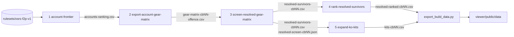

# Pipeline reference

The production pipeline is the Rust binary `pure_math` run five times in sequence for one combat level: enumerate exact accounts, attach legal gear, resolve every attack style into exact rolls and prune dominated rows, rank the survivors, and expand each survivor into KO-switch kits. Each stage reads the ruleset plus the previous stage's CSV and writes a CSV plus a JSON report whose `verification` block states what the numbers do and do not model. Stages 1–4 have a Python reference implementation (`python -m pure_solver <command>`) that produces byte-identical files; Stage 5 is Rust only. This page lists every stage with its flags and defaults (taken from the command modules under [`pure_math/src/commands`](../pure_math/src/commands)), the wrapper scripts, the viewer export, the sharding tools, and the Python-only commands. The math behind the columns is in [methodology.md](methodology.md); how the components fit together is in [architecture.md](architecture.md).

## Overview



Conventions shared by every stage:

- The first positional argument is the ruleset directory (`rulesets/osrs-f2p-v1`); the binary reads `mechanics.json` and `items.json` from it.
- Flags are `--name=value` or `--name value`. Defaults below are the binary's own; the wrapper scripts override some of them (see [Running the whole pipeline](#running-the-whole-pipeline)).
- Every command prints a JSON summary (counts and echoed output paths) to stdout; Stage 5 prints progress to stderr.
- All files are CRLF, fractions are `n/d`, booleans are `True`/`False`, JSON is canonical pretty JSON (see [architecture.md](architecture.md#output-conventions)).
- `pure_math version` prints the crate version; `pure_math help` (also `--help`, `-h`) prints the usage text with every flag and default.

Build the binary once with `cargo build --release` inside `pure_math/`; the scripts expect `pure_math/target/release/pure_math` (`.exe` on Windows).

## Stage 1: `account-frontier`

**Purpose.** Enumerate every account at exactly the requested combat level and reduce it to a Pareto frontier. For each Defence level requested, the enumerator walks every Attack/Strength/Ranged triple that can fit the combat level, every verified Prayer breakpoint (lifted to the odd level that costs the same combat), every Hitpoints level reachable through standard F2P combat training of those skills (4 XP per damage to the trained skill, 4/3 XP to Hitpoints; Magic excluded because it trains without Hitpoints; Defence XP counts), and fills Magic to the highest level that keeps the combat level exact. Two Pareto sets are kept per Defence level: the ranking set (Pareto over Attack, Strength, Ranged, Prayer, Hitpoints and Defence, with Magic treated as leftover fill) and the full set (Magic preserved as a dimension, the legal universe). Frontiers are taken within each Defence level and concatenated.

```text
pure_math account-frontier <ruleset>
    [--combat-level=30]
    [--defence-levels=1]            # "1", "1-40", or a list such as "1,5,10,15,20,30,40"
    [--ranking-output=outputs/cb30/accounts-ranking.csv]
    [--full-output=outputs/cb30/accounts-full.csv]
    [--report-output=outputs/cb30/account-frontier.json]
```

Python reference (1 Defence only):

```powershell
$env:PYTHONPATH = 'src'
python -m pure_solver account-frontier rulesets/osrs-f2p-v1 --ranking-output outputs/cb30/accounts-ranking.csv --full-output outputs/cb30/accounts-full.csv --report-output outputs/cb30/account-frontier.json
```

| | |
| --- | --- |
| Inputs | `mechanics.json` (`combat_level` must carry formula version `osrs-wiki-combat-level-15305725`; `experience.level_threshold`; prayer tables). |
| Outputs | `accounts-ranking.csv` and `accounts-full.csv` with columns `attack, strength, ranged, magic, prayer, hitpoints, defence, combat_level`; `account-frontier.json` with `counts` (`raw_legal_states`, `ranking_frontier`, `full_frontier`), `prayer_levels`, `defence_level`(s) and scope strings. |
| Size (as of 2026-09-02) | CB30, 1 Defence: 1,601,097 raw states, 2,925 ranking accounts, 38,213 full. CB40, 1 Defence: 4,065,498 raw states, 3,977 ranking accounts, 66,830 full. CB40, Defence 1/5/10/15/20/30/40: 20,731,642 raw states, 24,084 ranking accounts, 329,020 full. Defence 1–40 every level: 133,467 ranking accounts (too many for the later stages). |
| Runtime | Seconds; the whole of Stages 1–4 for CB40 at 1 Defence took 42 s. |
| Not modelled | Quest or non-combat Hitpoints XP; Prayer levels off the verified breakpoints; Magic as a compared skill, so magic-dominant accounts are pruned before gear (the known mage-pure gap in [status.md](status.md)). `--defence-levels=1` reproduces the original 1-Defence search byte-for-byte. |

## Stage 2: `export-account-gear-matrix`

**Purpose.** Attach every legal loadout to every account. Accounts sharing an equipment-unlock signature (the sorted list of item ids they can equip) share one gear expansion. Per account, dominated items are pruned first (see the rules in [architecture.md](architecture.md#equipment-reduction-rules)). In the default `offence_pareto` mode each weapon gets the armour that is Pareto-optimal in the bonuses that weapon can use (ranged: `attack_ranged`, `ranged_strength`; melee: the weapon's `attack_<type>` bonuses plus `melee_strength`), ties resolved by total defence then lowest item id, so skill combinations are compared on equal gear footing. `full` mode expands every retained armour combination and is meant for shortlisted accounts only. Each weapon gets its best compatible ammunition (highest ranged strength, then ranged attack) and, when one-handed, the offensive shield "Mooleta". `--keep-defensive=true` adds, per weapon, one extra row wearing the most defensive legal item in every slot and offers the most defensive legal shield beside Mooleta, so tank loadouts survive the offence pruning. `--completed-quests` lists quests assumed done for item legality (three catalog items need Dragon Slayer I).

```text
pure_math export-account-gear-matrix <ruleset> <accounts.csv>
    [--kit-mode=offence_pareto]     # offence_pareto | full
    [--keep-defensive=false]        # true/1/yes or false/0/no
    [--completed-quests=]           # semicolon-separated quest names; the scripts pass "Dragon Slayer I"
    [--csv-output=outputs/cb30/gear-matrix.csv]
```

Python reference (`--kit-mode` only):

```powershell
python -m pure_solver export-account-gear-matrix rulesets/osrs-f2p-v1 outputs/cb30/accounts-ranking.csv --csv-output outputs/cb30/gear-matrix-cb30-offence.csv
```

| | |
| --- | --- |
| Inputs | Stage 1 ranking CSV; `items.json`. |
| Outputs | One CSV row per loadout: `profile_id` (1-based account index), skill band columns (`<skill>_min`/`<skill>_max`), `account_attack` … `account_hitpoints` (seven levels; `account_defence` carries the real Defence level), `<slot>_id`/`<slot>_name` for head, neck, body, legs, hands, weapon, ammo and shield (`EMPTY` when unworn), `weapon_slot`, `req_<skill>` aggregate requirements, the 14 bonus columns (`attack_stab` … `prayer`), `weapon_type`, `weapon_attack_speed`, `weapon_attack_range`, `weapon_attack_styles` (semicolon-joined), `two_handed`. |
| Size (as of 2026-09-02) | CB30: 82,105 rows from 2,925 accounts. CB40 with Defence breakpoints: 1,437,550 rows. |
| Runtime | Seconds to a minute; the CB40 breakpoint matrix is about 0.5 GB. |
| Not modelled | Cape, boots and ring slots (absent from the catalog); any shield other than Mooleta on the offensive path; more than one ammunition per weapon. |

## Stage 3: `screen-resolved-gear-matrix`

**Purpose.** Turn every matrix row into an exactly resolved candidate and prune it. For each listed attack style the combat kernel evaluates the pinned formulas for attack roll, unboosted and Strength-potion max hit, cooldown (rapid shortbows fire one tick faster), range, and per-style defence rolls against stab, slash, crush and ranged. Candidates are deduplicated when their comparison class, resolved metrics and capabilities are identical, and Pareto-pruned inside their comparison class (same account, weapon type, styles, ammo, spells, mechanic flags, handedness) when another candidate is weakly better on every metric with a superset of capabilities. Survivors then receive representative cadence summaries: best expected damage per tick and the probability of dealing at least 5/10/15/20/25/30 damage within 4/5/8/12-tick windows, against low, medium and high defence rolls (the 1/10, 1/2 and 9/10 quantiles of the population's defence rolls per damage type).

```text
pure_math screen-resolved-gear-matrix <ruleset> <matrix.csv>
    [--manifest-output=outputs/cb30/resolved-survivors.csv]
    [--report-output=outputs/cb30/resolved-screen-report.json]
    [--audit-limit=20]              # audit examples kept in the report
```

Python reference:

```powershell
python -m pure_solver screen-resolved-gear-matrix rulesets/osrs-f2p-v1 outputs/cb30/gear-matrix-cb30-offence.csv --manifest-output outputs/cb30/resolved-survivors-cb30.csv --report-output outputs/cb30/resolved-screen-cb30.json
```

| | |
| --- | --- |
| Inputs | Stage 2 CSV; `mechanics.json`; `items.json` (every referenced item id must exist). |
| Outputs | Survivor manifest sorted by `candidate_id`: `candidate_id`, `resolved_signature`, `resolved_styles_json` (per-style `attack_roll`, `max_hit`, `potted_max_hit`, `cooldown_ticks`, `maximum_range`), `best_expected_damage_per_tick_json`, `cadence_ko_probabilities_json` (keys `label:window:hp`), `cadence_ko_scope`, followed by every input column. Report: `counts` (`starting_candidates`, `exact_duplicates_removed`, `dominated_candidates_removed`, `remaining_pareto_candidates`), `representative_defence_rolls` (read again by Stage 5), `windows`, `hp_thresholds`, audit examples, and the `account_profile_scope` string (`exact accounts …` when every row carries a fully specified profile). |
| Size (as of 2026-09-02) | CB30: 82,105 → 75,665 survivors (about 0.4 GB). CB40, 1 Defence: 112,992 survivors. CB40 breakpoints: 1,437,550 → 1,362,704 (74,846 dominated, 0 duplicates; 7.4 GB). |
| Runtime | CB40 breakpoints: 6 min. Memory grows with the matrix; see [Sharding and merging](#sharding-and-merging). |
| Not modelled | Anything beyond one equipped weapon per row; projectile delay and weapon switching in the cadence windows (`cadence_ko_scope` says so); prayer or boosts on defence rolls. The cadence numbers are report features, not the dominance proof. |

## Stage 4: `rank-resolved-survivors`

**Purpose.** Order every survivor for later evaluation without deleting any row. The ranker selects a diverse 32-row opponent panel (forced metric extremes, one representative per damage type and per weapon type, then farthest-point sampling on integer midranks), runs a closed-form attrition race of every survivor against that panel with equal notional food, and scores five categories as population midrank percentiles: sustain, race, burst, defence and utility. The overall score is their equal-weight mean; tiers S/A/B/N/C are cut at 1%, 5% and 20% of the population with N reserved for lower-ranked panel members and top-1% niche extremes.

```text
pure_math rank-resolved-survivors <ruleset> <manifest.csv>
    --ranked-output=<ranked.csv>    # required
    --report-output=<report.json>   # required
    [--panel-size=32]
    [--food-slots=28]
    [--heal-per-eat=14]
    [--eat-penalties=3,0]           # must include both 3 and 0
    [--preview-size=50]
```

Python reference (alias `rank-resolved-candidates`):

```powershell
python -m pure_solver rank-resolved-survivors rulesets/osrs-f2p-v1 outputs/cb30/resolved-survivors-cb30.csv --ranked-output outputs/cb30/resolved-ranked-cb30.csv --report-output outputs/cb30/resolved-ranking-cb30.json --panel-size 32
```

| | |
| --- | --- |
| Inputs | Stage 3 manifest; `mechanics.json`. |
| Outputs | Ranked CSV in rank order with 59 fixed fields followed by the manifest's source columns. Notable fields: `rank`, `tier`, `candidate_id`, `overall_score` (fraction) and `overall_score_decimal`, the five `*_score` percentiles, `race_penalty3_worst_fish`, `race_penalty3_p10_fish`, `race_penalty3_mean_fish`, `race_penalty0_worst_fish`, `race_penalty0_mean_fish`, `dpt_low/medium/high`, `ko_4_tick` … `ko_12_tick`, `maximum_attack_roll`, `max_hit`, `potted_max_hit`, `maximum_range`, four `defence_*_roll` columns, `magic_attack_bonus`, `magic_defence_bonus`, `prayer_bonus`, `niche_flags`, `rank_reasons`, `simulator_seed`, `simulator_seed_reasons`, `profile_id`, seven `account_*` levels, eight `*_name` equipment columns, `weapon_type`, `weapon_slot`, `two_handed`, `damage_types`, `style_ids`. Report: `verification`, `counts` (including tier counts and matchup-count arithmetic), `formula`, `configuration`, `simulator_seed_panel` with selection reasons, `top_preview`. |
| Size (as of 2026-09-02) | CB30 tiers: S 757 / A 3,027 / B 11,349 / N 1,923 / C 58,609. CB40 breakpoints: 1,362,704 ranked rows (3.3 GB). |
| Runtime | About 7 s for CB30 (75,665 rows); 2.7 min for 1,362,704 rows. |
| Not modelled | Movement, projectile arrival alignment, weapon switching, spell damage, prayer activation, potion timing, opponent policy; carried switches, runes, potions and food composition (every row gets the same 28 food). The report's `verification.status` is `heuristic_priority_order_only`. |

## Stage 5: `expand-ko-kits`

**Purpose.** Expand each survivor into kits and rank the kit population. A kit is one survivor (account, armour, primary weapon) plus, optionally, one carried melee KO weapon that out-hits the primary; every survivor also keeps a baseline no-switch kit. Each KO weapon is also tried with the worn amulet swapped for the legal amulet with the highest melee strength bonus (Amulet of strength) when that raises the KO max hit, at the cost of one more switch slot. Both comparisons use the potted max hit when `--strength-potions` is above zero, because that is the hit the KO tables score; a swap that only pays off potted (Amulet of strength at 50 Strength on a Rune warhammer: 16 against 15) is therefore a kit, and a switch that only out-hits the unpotted primary is not. With `--strength-potions=1` (default) one inventory slot holds a Strength potion and melee hits in the KO and kill-pressure tables use the potted max hit (boost 3 + floor(Strength/10)); the race stays unpotted. With `--magic=1` (default) every kit also gets a runes variant carrying the hardest F2P spell the account can cast when its max hit beats the primary weapon, cast bare-handed so each distinct rune type costs one slot. Per kit the stage computes an exact range-to-melee stack KO table (rapid shortbow arrow plus one KO hit; shortbow primaries only), a switch-cadence KO table (primary fires, KO weapon fires once the carried cooldown expires), the attrition race with `inventory − switch slots − potions − rune slots` food against the Stage 4 panel, a sixth score category `ko_switch`, and the raw-probability kill-pressure columns (`kill_pressure`, `kill_bite`, `finish_10/15/20`, `max_burst`, `pressure_rank`). Definitions are in [methodology.md](methodology.md).

```text
pure_math expand-ko-kits <ruleset> <manifest.csv>
    --screen-report=<resolved-screen.json>   # required; only representative_defence_rolls is read
    --kits-output=<kits.csv>                 # required
    --report-output=<report.json>            # required
    [--panel-size=32]
    [--inventory-slots=28]
    [--heal-per-eat=14]
    [--eat-penalties=3,0]
    [--preview-size=50]                      # kits that get full KO tables in the report
    [--threads=<cores minus 2>]              # worker threads; at least 1
    [--max-ko-options=0]                     # KO loadouts kept per build (best potted max hit, then attack roll); 0 = all
    [--max-builds=0]                         # shortlist survivors first (union of top-N by DPT, by Strength/potted max hit, by defence); 0 = all
    [--strength-potions=1]                   # potions carried; 0 reproduces the pre-potion output
    [--magic=1]                              # 1 adds the runes variants; 0 disables magic
```

There is no Python reference for this stage. The design is in [`design/2026-09-01-ko-kit-expansion-design.md`](design/2026-09-01-ko-kit-expansion-design.md).

| | |
| --- | --- |
| Inputs | Stage 3 manifest and screen report; `mechanics.json` (including `magic.f2p.spells`); `items.json`. The stage rebuilds each row's armour from the catalog and fails if the row's bonus columns are not the exact item sums. |
| Outputs | `kits.csv` in rank order with 96 fixed fields (`KIT_FIELDS` in [`kits/output.rs`](../pure_math/src/kits/output.rs)) and no manifest columns; `candidate_id` joins back to the Stage 3 manifest. Notable fields: `kit_id`, `is_baseline`, `ko_weapon_id/name`, `ko_max_hit`, `ko_potted_max_hit`, `ko_attack_roll`, `ko_cooldown_ticks`, `switch_slots`, `food_slots`, the six `*_score` percentiles including `ko_switch_score`, `stack_ko_5` … `stack_ko_30`, `switch_ko_4_tick` … `switch_ko_12_tick`, the primary's Stage 4 columns, then `kill_pressure`, `kill_bite`, `finish_10`, `finish_15`, `finish_20`, `pressure_rank`, `strength_potions`, `max_burst`, `ko_neck_id/name`, `spell_name`, `spell_max_hit`, `spell_attack_roll`, `rune_slots`. Report: `verification` (scope strings and `not_modelled` list), `counts` (`survivor_rows`, `kits`, `baseline_kits`, `switch_kits`, `survivors_with_ko_option`, tiers), `formula`, `configuration`, the panel, and `top_preview` with full stack and switch tables for the first `preview_size` kits. |
| Size (as of 2026-09-02) | CB30: 75,665 survivors → 918,427 kits before potion/amulet/magic, 1,168,086 with the amulet switch, 2,335,208 with all three additions. CB40, 1 Defence: 112,992 survivors → 1,660,515 → 4,349,384 kits. CB40 Defence breakpoints with `--max-builds=150000 --max-ko-options=2 --magic=0`: 433,845 shortlisted survivors → 1,152,628 kits. The CSVs are multi-GB; query them with a columnar tool rather than a spreadsheet. |
| Runtime | CB30 before the additions: 94 s on 22 threads (KO tables 14 s, races 56 s). CB40 with all three additions: about 9 min for 4.35 M kits (KO tables about 1.5 min, races about 6.5 min). CB40 breakpoints with the shortlist: 8 min. The default thread count leaves two cores free. |
| Not modelled | Declared in the report: movement and distance, projectile flight ticks, PID order, prayer, shield defence loss on a 2H switch; panel opponents stay single-weapon with full inventory food and never switch or cast; no magic-to-melee stack; the stack term exists only for rapid shortbow primaries; the opponent magic defence roll uses the standard 70/30 rule, which is flagged `magic.defence_roll_unverified` because it is not a verified ruleset mechanic. |

## `shortlist-survivors`

Writes the survivor rows Stage 5 would keep under `--max-builds` as a smaller manifest, so Stage 4 and Stage 5 can be run on the same bounded population. The shortlist is the union of the top-N survivors by medium-defence DPT, by Strength (then potted max hit, then max hit), and by average physical defence roll (then Hitpoints), ties broken by candidate id; the manifest's row order is preserved.

```text
pure_math shortlist-survivors <ruleset> <manifest.csv> --output=<manifest.csv> [--max-builds=0]
```

## Running the whole pipeline

[`pure_math/scripts/run_pipeline.ps1`](../pure_math/scripts/run_pipeline.ps1) runs all five stages for one combat level into `outputs/cb<level>-rust/` and names the files `accounts-ranking.csv`, `accounts-full.csv`, `account-frontier.json`, `gear-matrix-cb<level>-offence.csv`, `resolved-survivors-cb<level>.csv`, `resolved-screen-cb<level>.json`, `resolved-ranked-cb<level>.csv`, `resolved-ranking-cb<level>.json`, `kits-cb<level>.csv`, `kits-cb<level>.json`. It stops on the first non-zero exit code and prints elapsed time per stage.

```powershell
powershell -File pure_math\scripts\run_pipeline.ps1 -CombatLevel 40 -DefenceLevels '1,5,10,15,20,30,40'
```

| Parameter | Default | Effect |
| --- | --- | --- |
| `-CombatLevel` | `40` | Exact combat level; also names the output directory. |
| `-DefenceLevels` | `'1'` | Passed to Stage 1 `--defence-levels`. The default is the classic 1-Defence pure search; the recorded Defence runs use `'1,5,10,15,20,30,40'`. Every level `'1-40'` at once produced 133,467 accounts and ran out of memory at Stage 5. |
| `-MaxKoOptions` | `4` | Stage 5 `--max-ko-options`. |
| `-CompletedQuests` | `'Dragon Slayer I'` | Stage 2 `--completed-quests`. |
| `-KeepDefensive` | `'true'` | Stage 2 `--keep-defensive`. |
| `-Threads` | `0` | Stage 5 `--threads` when positive; `0` keeps the binary default. |

Companion scripts:

| Script | Purpose |
| --- | --- |
| [`run_stages.ps1`](../pure_math/scripts/run_stages.ps1) `-CombatLevel 40 -Stages 2,3,4,5 [-MaxKoOptions 4] [-MaxBuilds 0] [-Magic 1] [-CompletedQuests …] [-KeepDefensive true] [-Threads 0] [-OutDir outputs\cb40-rust-1def]` | Re-runs a subset of stages against existing outputs (Stage 1 output must already exist for 2+). This is where `--max-builds` and `--magic` are exposed. `-OutDir` reads and writes another folder instead of `outputs\cb<level>-rust`, for example to redo Stage 5 of the 1-Defence run without touching the Defence-opened one. |
| [`rerun_kits.ps1`](../pure_math/scripts/rerun_kits.ps1) `[-Levels 40]` or `-Levels 30,40` | Re-runs Stage 5 for each listed level and then the viewer export for it. |
| [`screen_chunks.ps1`](../pure_math/scripts/screen_chunks.ps1) `-CombatLevel 40` | Memory-bounded Stage 3 over gear-matrix chunks; see below. |
| [`run_pipeline.sh`](../pure_math/scripts/run_pipeline.sh) `[combat_level=40] [defence_levels=1] [max_ko_options=4] [threads=0]` | Linux/macOS equivalent of `run_pipeline.ps1`; builds the release binary if it is missing; `COMPLETED_QUESTS` and `KEEP_DEFENSIVE` come from the environment. |

Long runs are CPU-bound on Stage 5; launching the shell at below-normal priority keeps the desktop responsive while the default thread count leaves two cores free.

## Exporting data for the viewer

```text
python viewer/scripts/export_build_data.py <combat_level> [cap]     # default level 30, cap 250000; cap 0 = everything
```

The exporter reads `outputs/cb<level>-rust/resolved-ranked-cb<level>.csv` and `kits-cb<level>.csv` and writes `viewer/public/data/builds-<level>.json` and `kits-<level>.json`, each also gzipped (the page reads the `.json`; the `.gz` copies are the release assets that `fetch_data.py` downloads). Both files are dictionary-encoded: `{"version", "count", "fields", "strings", "rows", "tierCounts"}`, where every row is an array of integers in `fields` order, strings are indices into `strings`, and fractions are scaled integers (builds use a scale of 1,000,000; kits use 10,000, with race margins and bite scaled by 100). Build rows are in rank order; kit rows point at their build by row index.

The cap keeps the browser dataset loadable: the exporter keeps every kit whose build appears in the top `cap` slice of either ranking (`rank` or `pressure_rank`), plus every other kit of those builds so the "all KO options" panel stays complete, and drops runes variants that do not out-pressure their no-runes twin. The `selection` block in `kits-<level>.json` records `csv_rows`, `after_rune_twin_filter`, `cap`, `builds_in_slice` and `exported`. When the kits CSV is absent only `builds-<level>.json` is written. As of 2026-09-02 the level-40 export takes about 5 min and the uncapped `kits-40.json` is about 0.5 GB, which is at the edge of what a browser tab will load.

## Sharding and merging

**Combat-level shards.** Each combat level is an independent run into its own `outputs/cb<level>-rust/` directory; nothing is shared between levels, so levels can run on different machines and the viewer switches between them by file name. The Python offense frontier also supports explicit combat ranges (`--combat-min`/`--combat-max`) whose results are merged with `merge-frontiers`; that path is exploratory and its shards merge only when their catalog scope and reproducibility fields match.

**Stage 3 chunks.** Stage 3 holds every resolved candidate in memory, which the 1.4-million-row CB40 breakpoint matrix strains. [`screen_chunks.ps1`](../pure_math/scripts/screen_chunks.ps1) runs Stage 3 once per file matching `outputs/cb<level>-rust/chunks/gear-*.csv` (each chunk must carry the full gear-matrix header), writes `chunks/survivors-<n>.csv` and `chunks/screen-<n>.json`, concatenates the survivor chunks into `resolved-survivors-cb<level>.csv` with a single header, and copies `chunks/screen-01.json` to `resolved-screen-cb<level>.json`. Two consequences follow from how Stage 3 works: dominance is decided inside a comparison class (same profile and weapon action set), so a profile split across chunks can only leave extra dominated rows in the manifest, never remove a row a single pass would keep; and each chunk's representative defence rolls are quantiles of that chunk alone, so the cadence columns and the screen report handed to Stage 5 come from chunk 01's population rather than the whole matrix. Splitting the matrix into chunks is left to the operator.

**Bounding Stage 5.** For large survivor populations use `--max-builds` (inside `expand-ko-kits`) or `shortlist-survivors` (to give Stage 4 the same population), together with `--max-ko-options` to cap KO loadouts per build. The recorded CB40 breakpoint run used `--max-builds=150000 --max-ko-options=2 --magic=0`.

## Python-only commands

All commands run as `python -m pure_solver <command>` with `PYTHONPATH=src` (see [`cli/`](../src/pure_solver/cli)). Status: **production** means the command is the only way to do that job; **reference** means a Python implementation whose output the Rust binary reproduces or supersedes; **exploratory** means research code that is not on the ranking path and whose reports are provisional by construction.

| Command | Purpose | Status |
| --- | --- | --- |
| `inspect <ruleset>` | Validate a ruleset (catalogs, source archive, required mechanics) and print reproducibility metadata: ids, source revisions, item/consumable/mechanics database hashes. | production |
| `fetch-wiki-page <title> <output>` | Fetch one page from the OSRS Wiki API and preserve its revision, timestamps, content hash and raw wikitext as a source record. | production |
| `observe-wiki-item <title> <output>` | Parse an unpromoted item observation from a pinned wiki page. | production |
| `observe-wiki-search <query> <output> [--limit N]` | Parse unpromoted equipment observations for every page matching a wiki search (this produced `research/observations/f2p-equipment.json`). | production |
| `add-items <ruleset> [titles…] [--no-fetch]` | Archive, register, decide, rebuild and re-verify equipment from wiki pages in one pass; the default title list is the F2P Defence armour and staves. | production |
| `rebuild-items <ruleset> <decisions> [--output]` | Regenerate `items.json` from pinned sources and review decisions. | production |
| `rebuild-consumables <ruleset> <decisions> [--output]` | Regenerate `consumables.json` (food and potion states) from pinned sources and review decisions. | production |
| `gear-audit <ruleset> --attack --strength --ranged --magic --prayer --hitpoints` | Show legal items, dominance removals and primary/KO/ammo kits for one account. | production (diagnostic) |
| `catalog-audit <ruleset> <snapshot> [--preview 20]` | Summarise observation completeness and the promotion backlog; LMS/Deadman variants stay audit-only. | production (audit) |
| `export-gear-catalog <ruleset> <snapshot> [--attack 40 …] --json-output --csv-output [--survivor-csv-output] [--level-profiles-output] [--level-item-matrix-output]` | Export an account-legal observation cache plus the verified dominance audit. | reference |
| `export-gear-matrix <ruleset> [--maximum-level 40] --json-output --csv-output` | Export verified head/neck/body/legs/hands/weapon combinations for skill bands (the legacy band model, not exact accounts). | reference |
| `export-exact-gear-matrix <ruleset> [skill ranges] [--combat-min 30 --combat-max 40] [--account-mode] [--max-candidates] --json-output --csv-output` | Export verified combinations for exact achievable accounts in a stat range. | reference |
| `account-frontier` | Stage 1 reference (1 Defence only). | reference |
| `export-account-gear-matrix` | Stage 2 reference (`--kit-mode` only). | reference |
| `select-top-accounts <ruleset> <ranked.csv> [--limit 50] --output` | Collect the distinct accounts behind the best-ranked rows for a full-gear (`--kit-mode full`) re-run. | reference |
| `screen-gear-matrix <ruleset> <matrix.csv> [--seed-size 32] [--audit-limit 20] [--output]` | The older static equivalence/dominance screen with a 20–50 seed active set; superseded by the resolved screen. | reference |
| `screen-resolved-gear-matrix` | Stage 3 reference. | reference |
| `rank-resolved-survivors` (alias `rank-resolved-candidates`) | Stage 4 reference. | reference |
| `offense-frontier <ruleset> [skill ranges] [--target-*] [--top 10] [--max-candidates] [--account-mode] [--output]` | Closed-form offensive frontier; output is labelled `verified_for_closed_form_offense_only` and `catalog_complete: false`. | exploratory |
| `merge-frontiers <output> <inputs…> [--top 10]` | Merge combat-level offense-frontier shards with identical catalog scope. | exploratory |
| `validate-timing-experiment <input> [--minimum-samples 20]` | Validate captured timing evidence against the suite protocol; conflicts raise instead of averaging. | production (data) |
| `solve <ruleset> [skill ranges] [--samples 100] [--seed 1] [--maximum-ticks 200] [--max-candidates 1] [--max-strategies 32] [--account-mode] [--output]` | Bounded strategy-aware melee/ranged duel game with seeded Monte Carlo, resource telemetry, counters, Pareto rankings and equilibrium weights; emits `verification.status: "blocked"` when a required duel mechanic is not promoted. | exploratory |
| `solve-active <ruleset> [as solve] [--candidate-pool-size 256] [--initial-active-size 32] [--outside-batch-size 24] [--oracle-epsilon 0.02] [--oracle-max-iterations 12] [--output]` | Bounded restricted-policy pool through the sparse two-sided double oracle; provisional by construction. | exploratory |

The Python test suite (`python -m pytest tests` or `python -m unittest discover -s tests`) covers all of the above; the Rust suite runs with `cargo test --release` inside `pure_math/`.
