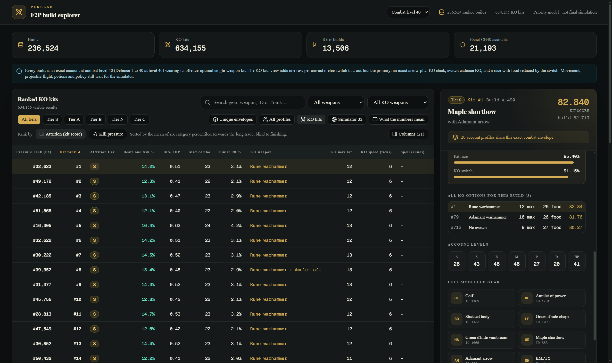
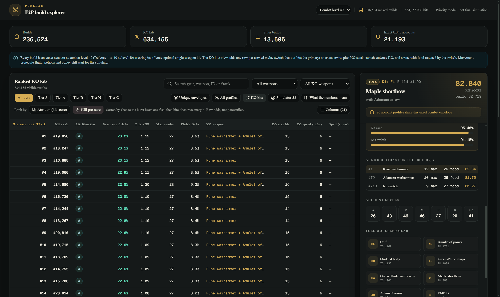
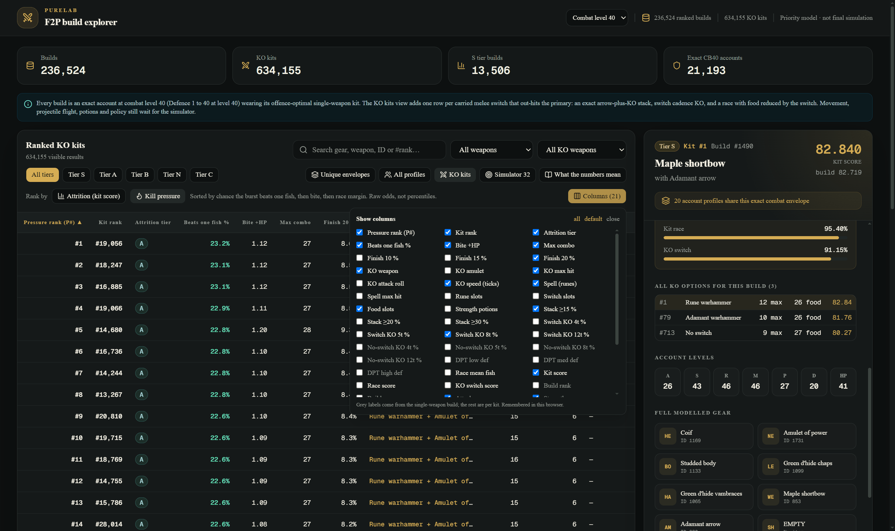
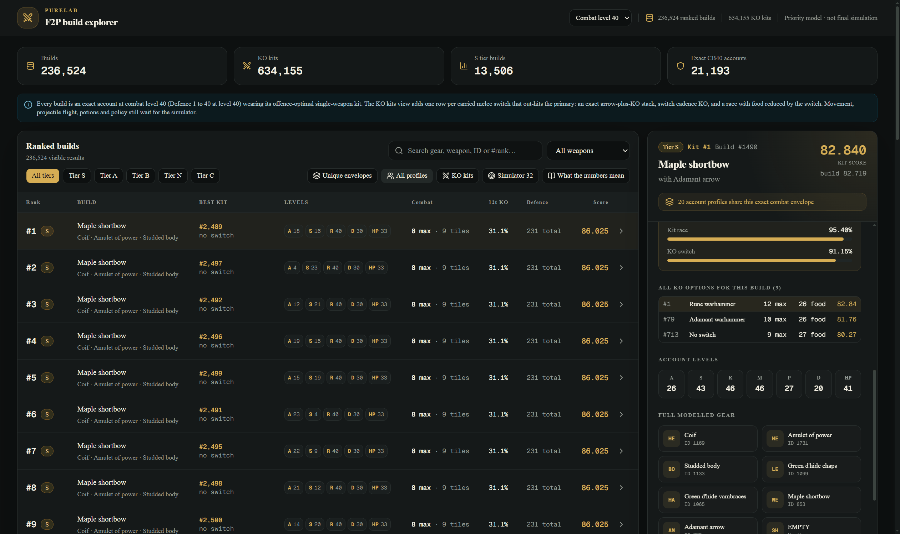
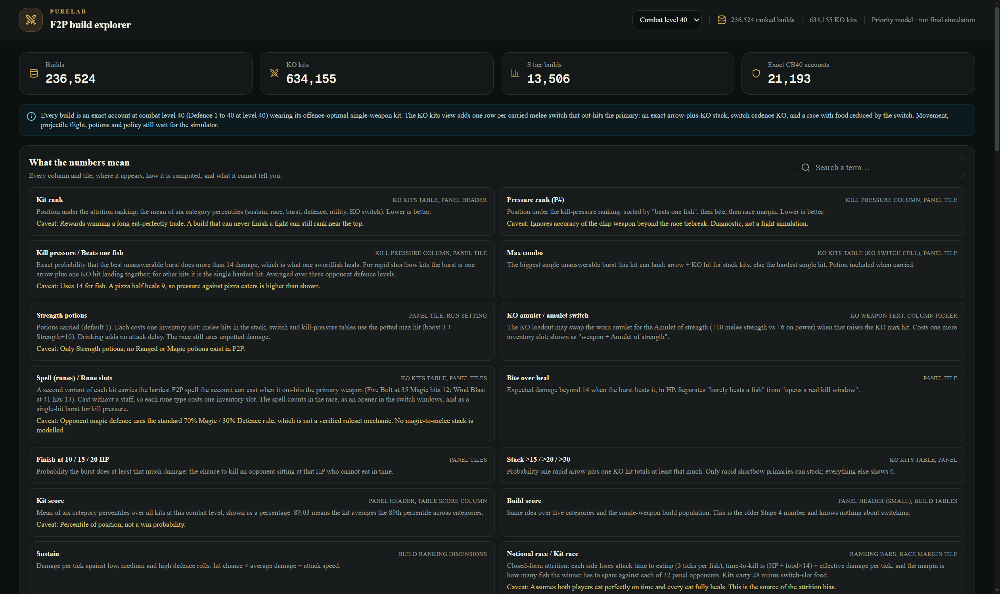

# PureLab viewer guide

PureLab is the browser explorer for the solver's output. It loads the ranked builds and KO kits for one combat level, lets you filter, sort and group them, and explains every number it shows. This page is a tour of the interface; [viewer/README.md](../viewer/README.md) covers installing and running it, and [methodology.md](methodology.md) covers the math behind the columns.



## Running it

```bash
cd viewer
npm ci
python scripts/fetch_data.py        # downloads the datasets from the GitHub release
npm run dev                         # the app on http://localhost:3000
```

The dev server serves the datasets straight from `public/data`. `npm run build` followed by `npm start` serves a production build the same way. Nothing is hosted anywhere; the viewer is a local tool.

## The screen

**Header.** The combat-level menu switches between the level-30 and level-40 datasets. The counters next to it show how many ranked builds and KO kits are loaded. "Priority model · not final simulation" is a permanent reminder that every rank on this page is a scheduling heuristic from a closed-form model, not a simulated win rate.

**Summary tiles.** Builds, KO kits, S-tier builds and the number of exact accounts at that combat level. The banner underneath states the scope of the dataset (which Defence levels were searched, which mechanics still wait for the simulator).

**Views.** Three buttons choose what the main table lists. A fourth, **Simulator 32**, is a filter rather than a view: it keeps only the 32-build opponent panel that the race and KO tables measure every kit against, in whichever view is active.

| View | One row is | Use it to |
| --- | --- | --- |
| KO kits | one build plus one carried switch (or "no switch") | find the strongest overall setups; this is the headline ranking |
| Unique envelopes | one combat envelope, with the count of account profiles that share it | see distinct gear-plus-max-hit shapes without duplicate skill splits |
| All profiles | one exact account plus its single-weapon kit | compare specific skill splits |

**Filters.** Search matches gear, weapon and ID text, and `#123` jumps to a rank. The weapon-type and KO-weapon menus narrow the table, and the tier buttons (S, A, B, N, C) filter by attrition tier.

**Stat filters.** "Stat filters" opens a row of min/max boxes over the combat levels (attack, strength, ranged, magic, prayer, defence, hitpoints) and the damage stats (primary and KO max hit, max combo, no-switch KO 4t and 12t, switch KO 12t, and the three DPT columns). Bounds are inclusive, and you type them in the units the table shows: `70` for a level, `12.5` for a percentage column, `3.125` for a DPT. Leave a box empty for no limit on that side. The button carries the number of stats currently narrowing the table, and every stat has to match. KO max hit, max combo and switch KO come from the kit, so those three boxes only appear in the KO kits view; the rest filter in all three views.

**Pin and compare.** The pin in each row adds it to a comparison of up to four rows, shown under the table. The comparison has one row per visible column, so the column picker decides what gets compared, and the best value in each row is highlighted — lowest wins for the three rankings, the KO speed and the two slot costs, highest for everything else. "Differences only" hides the columns every pinned row agrees on. Kits and builds pin separately, so switching views keeps both sets, and changing combat level clears them because the pins are row ids within one level's dataset.

**Rank by.** The KO kits view opens ranked by the attrition kit score, the mean of six category percentiles, which rewards winning a long, eat-perfectly trade and is blind to finishing, so it is the default. The toggle switches to kill pressure: the raw probability that your best unanswerable combo (rapid arrow plus KO hit, Strength potion on) does more than one fish heals — the thing that forces a real opponent to eat early or die. The two orderings disagree by a lot on purpose; [methodology.md](methodology.md) explains why. A short explainer under the toggle says which one you are looking at.



**Columns.** The default columns are the things a player weighs when picking a build: pressure rank and kit rank, attrition tier, beats-one-fish %, bite, max combo, finish-20 %, the KO weapon with its max hit and speed, the spell, food slots, stack-≥15 % and switch-KO-8t %, five combat levels (attack, strength, ranged, defence and hitpoints), the primary weapon and the kit score. The column picker exposes every other kit and build field (KO tables, DPT, race numbers, category scores, full gear). Grey labels come from the single-weapon build, the rest are per kit. Your choice is remembered in the browser. Click any column header to sort by it.



**Copy rows as CSV.** Copies the filtered, sorted rows with the visible columns (first 50,000 rows) to the clipboard for a spreadsheet or DuckDB.

**Detail panel.** Selecting a row fills the right-hand panel: tier and rank, primary weapon and ammunition, kit and build scores, the ranking bars for each category, every KO option for that build with max hit and food slots, the account levels, and the full modelled gear with item IDs.



**Glossary.** "What the numbers mean" opens a searchable list of every column and tile: where it appears, how it is computed and, in gold, what it cannot tell you.



## Reading the main columns

| Column | Meaning |
| --- | --- |
| Kit rank | Position under the attrition ranking. Lower is better. Rewards winning a long, eat-perfectly trade. |
| Pressure rank (P#) | Position under the kill-pressure ranking: sorted by "beats one fish", then bite, then race margin. |
| Beats one fish % | Exact probability that the best unanswerable burst does more than 14 damage (one swordfish heal), averaged over three opponent defence levels. |
| Bite +HP | Expected damage beyond 14 when the burst beats it. Separates "barely beats a fish" from "opens a real kill window". |
| Max combo | The biggest single unanswerable burst the kit can land, potion included when carried. |
| Finish 10 / 15 / 20 % | Probability the burst does at least that much: the chance to kill an opponent sitting at that HP who cannot eat in time. |
| KO weapon, KO max hit, KO speed | The carried switch, its max hit against the panel, and its attack speed in ticks. "+ Amulet of strength" means the KO loadout also swaps the amulet. |
| Spell (runes) | The hardest F2P spell the account can cast when it out-hits the primary weapon, and the rune slots it costs. |
| Food slots | 28 minus the inventory slots taken by switches, potions and runes. |
| Stack ≥15 / ≥20 / ≥30 % | Probability one rapid arrow plus one KO hit totals at least that much. Only rapid shortbow primaries can stack. |
| Kit score | Mean of six category percentiles over all kits at this level. 89.03 means the kit averages the 89th percentile. A percentile of position, not a win probability. |

## Notes

- Level 40 datasets are large (tens of MB gzipped, hundreds of MB inflated). Give the tab some memory and wait for the counters in the header to appear before filtering.
- The envelope grouping treats two accounts as the same envelope when their gear and resolved combat numbers are identical, so the "equivalent profiles" count tells you how much freedom you have in the skill split.
- Every number in the table has a matching column in the pipeline's CSV output, so anything you see here can be reproduced from `outputs/cb<level>-rust/` with the commands in [pipeline.md](pipeline.md).
